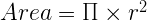
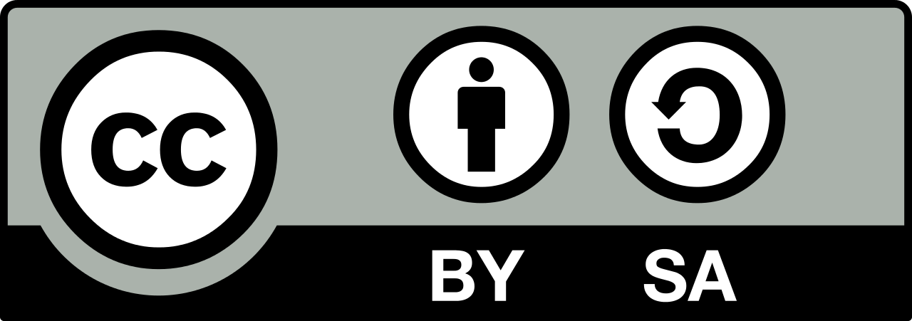

# Trasteando con Arduino #
Material utilizado para los talleres de Arduino en La Escuela Maker

## 1. Introducción a la programación ##

El **objetivo de la puntuación y la gramática** es que **las personas se puedan comunicar a través de la palabra escrita.** Utilizamos la coma para hacer una pausa, un punto para finalizar una oración y **la negrita para hacer énfasis.**

En los **lenguajes de programación se requiere de una sintaxis para comunicarnos con el compilador.** Lo mismo ocurre con un idioma, los signos de puntuación y la gramática son esenciales para entenderse.

El compilador leerá ese código y lo traducirá a código máquina para que lo entienda el microcontrolador.

Podemos decir que el compilador será tu profesor de lengua del instituto. La diferencia es que este profesor es el más exigente que hayas conocido ya que siempre requiere un 10 en tus programas :)

No te va a dejar pasar ni una. No es como escribir un email a un amigo donde da lo mismo si pones un punto de más o no pones un acento. **El compilador siempre exigirá que tengas todo perfecto.**

### 1.1 Comentarios en Arduino ###

Los comentarios no son más que notas que el programador va dejando dentro del código. Te ayuda a comprender parte de ese código.

Es una parte fundamental cuando estamos escribiendo un programa para Arduino. Sin embargo, no se compila es decir, no se traduce al código máquina. Cada vez que el compilador encuentra un comentario, se salta esa línea.

Tenemos dos formas de escribir un comentario:

```csharp
// Esto es un comentario de una sola línea

int variable = 0;

```

```csharp
/*
    Esto es un comentario
    multilínea
*/

int variable = 0;

```

### 1.2 El punto y coma ###

En el lenguaje de programación C++, el punto y coma (;) es como un punto y aparte. Básicamente lo que está diciendo es que **hemos terminado una sentencia y a partir de ese momento, empezamos algo nuevo sin relación a lo anterior a nivel de sintaxis**

### 1.3 Palabras reservadas ###

Seguramente ya hayas copiado y pegado algún código de Arduino de esos que encuentras por Internet. Al hacerlo, te habrás dado cuenta algunas palabras cambian el color de texto dentro del IDE de Arduino.

Son palabras reservadas por el lenguaje C++. Cada una de ellas tiene una función específica y están reservadas por el lenguaje de programación.

Esto quiere decir que no podemos utilizar esos nombres para nombrar una variable por ejemplo.

Lo importante es que **si cambia de color en el IDE de desarrollo, es que es una palabra reservada**

### 1.4 Las funciones ###

Las veremos detenidamente más adelante pero las funciones son una parte esencial en un programa.

Una función **no es más que un trozo de código que se usa frecuentemente dentro de un programa.** El **objetivo** es **facilitar la utilización de ese fragmento de código y que el programa quede más limpio y legible.**



Si traducimos está fórmula a código quedaría así:

```csharp
// Área de un círculo
float area = 3,141592 * radio * radio;
```

Ahora supón que tienes que utilizar esta línea de código muchas veces en tu programa. Quizás te interese convertir este fragmento en una función. No voy a mostrarte la implementación, solo te voy a mostrar la llamada.

```csharp
// Área de un círculo
calcularAreaCirculo(radio);
```
Queda mucho más fácil y mucho más limpio, ¿lo ves? Pero a mi lo que realmente mi interesa es que entiendas el concepto. 

Todas las llamadas a funciones **comienzan con el nombre** de la propia función. Luego va seguido de un **paréntesis abierto y si la función tiene parámetros, se incluirían a continuación separados por comas.
Por último cerramos el paréntesis y no te olvides del punto y coma** para indicar que hemos terminado con la sentencia.

```csharp
// Sintáxis de una función
nombreFuncion(parametro_1, parametro_2);
```

## 2. Las variables ##

Uno de los conceptos más importantes de la programación son las variables. Una variable **no es más que una herramienta de programación que nos ayuda a almacenar y recuperar información en nuestros programas.**


### Autor ###
Realizado por Ángel López Barrilero para La Escuela Maker.

Twitter: @anlobarri

Correo: angel@laescuelamaker.com


## Licencia ##
Licencia bajo  [Creative Commons Attribution-ShareAlike 4.0 International License](https://creativecommons.org/licenses/by-sa/4.0/)

